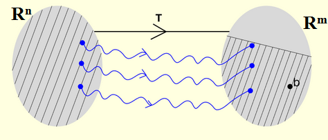

This experiment deals with the study of a linear map equation and its consistency. If it is consistent, the question whether solution is unique or not will be explored. Various examples are given to understand the concepts. The present study helps in developing a deeper understanding of consistency of a system of linear equations and its solution set.
### 1. Linear map equation:
Let <i>T</i>:<i>R</i><i>n</i>→<i>R</i><i>m</i> be a linear transformation and <i>b</i>&isin;<i>R</i><i>m</i>. Then equation <i>T</i>(<i>X</i>)=<i>b</i> is called a linear map equation.
The linear map equation <i>T</i>(<i>X</i>)=<i>b</i> is called consistent if it
has a solution, i.e. if there exists <i>X</i>&isin;<i>R</i><i>n</i> such that
<i>T</i>(<i>X</i>)=<i>b</i>. If it is not consistent, then it is called
inconsistent. Note that for <i>X</i>&isin;<i>R</i><i>n</i>, <i>X</i>≡(<i>x</i>1, <i>x</i>2, <i>x</i>3, …, <i>x</i><i>n</i> )
and <i>T</i>(<i>X</i>)&isin;<i>R</i><i>m</i>; where <i>x</i>1, <i>x</i>2, <i>x</i>3, …, <i>x</i><i>n</i> &isin;<i>R</i>. For <i>n</i>=2,
<i>X</i>≡( <i>x</i>1, <i>x</i>2 ) or (<i>x, y</i>), where <i>x</i>1 , <i>x</i>2 , <i>x, y</i>&isin;<i>R</i>.

 

### 2. Example:
(a) Let <i>T</i>:<i>R</i>2 →<i>R</i>3 be the linear transformation defined by
<i>T</i>(<i>x, y</i>)=(<i>x+y, x-y</i>, 0), where <i>x, y</i>&isin;<i>R</i>. Consider the
linear map equation <i>T</i>(<i>X</i>)=<i>b</i>, where <i>b</i>=(1, 1, 0). Then
we get (<i>x+y, x-y</i>, 0)=(1, 1, 0). This implies that
<i>x+y</i>=1and <i>x-y</i>=1. Thus <i>x</i>=1 and <i>y</i>=0. Clearly <i>T</i>(1, 0)=(1, 1, 0) which means that
solution of linear map equation exists. That is, linear
map equation is consistent. 
(b) Let <i>T</i>:<i>R</i>2 →<i>R</i>3 be the linear transformation defined
by <i>T</i>(<i>x, y</i>)=(<i>x+y, 2y, 2x</i>), where <i>x, y</i>&isin;<i>R</i>. Consider the
linear map equation <i>T</i>(<i>X</i>)=<i>b</i>, where <i>b</i>=(1, 4, 0). Then
we get (<i>x+y, 2y, 2x</i>)=(1, 4, 0). This implies that <i>x+y</i>=1,
2<i>y</i>=4, 2<i>x</i>=0. By solving equations (ii) and (iii) we get,
<i>y</i>=2 and <i>x</i>=0 which do not satisfy the equation
<i>x</i>+<i>y</i>=1, a contradiction. This means that solution of linear map equation
does not exist. That is, linear map equation is
inconsistent.

### 3. Solution:
Consider a linear map equation 
<i>T</i>(<i>X</i>)=<i>b</i> …….  (<i>i</i>) 
where <i>T</i>:<i>R</i><i>n</i>→<i>R</i><i>m</i> is a linear map and <i>b</i>&isin;<i>R</i> <i>m</i>. Note that in
particular, if <i>b</i>=0, then the linear map equation (<i>i</i>)
reduces to 
<i>T</i>(<i>X</i>)=0 …….  (<i>ii</i>)

#### 3.1. Condition for existence: 
By the definition of range <i>T</i>, linear map equation (<i>i</i>) is consistent if and only if <i>b</i>&isin;Range of <i>T</i>.  However, the linear map equation (<i>ii</i>) is always consistent, since <i>T</i> being linear <i>T</i>(0) =0. 

 

#### 3.2. Solution set: 
(a.) Assume <i>X</i>o to be a solution of equation (<i>i</i>).Then the solution set, i.e. the collection of all solutions of equation (<i>i</i>) is <i>X</i>0+ker(<i>T</i>)≡ {<i>X</i>o+<i>a</i>: <i>a</i>&isin;ker(<i>T</i>)}. 
Reason: If <i>a</i>&isin;ker(<i>T</i>), then <i>T</i>(<i>X</i>o+<i>a</i>)=<i>T</i>(<i>X</i>o)+<i>T</i>(<i>a</i>)=<i>b</i>+0=0, so that <i>X</i>o+<i>a</i> is a solution of linear map equation (<i>i</i>). 
Conversely, let <i>X</i> be a solution of equation (<i>i</i>). Then <i>T</i>(<i>X</i>)=<i>b</i>. Since <i>X</i>=<i>X</i>o+(<i>X</i>-<i>X</i>o) and (<i>X</i>-<i>X</i>o)&isin;ker(<i>T</i>),  hence <i>X</i>&isin;<i>X</i>o+ker(<i>T</i>). 
(b.) From 3.1, 0 is a solution of equation (<i>ii</i>). Clearly ker(<i>T</i>) is its solution set.
#### 3.3 Uniqueness of solution:
(a.) Let solution of equation (<i>i</i>) exist. Then solution is unique if and only if <i>T</i> is one-to-one by the definition of one-to-one map. 
(b.) Solution of equation (<i>ii</i>) is unique if and only if <i>T</i> is one-to-one by definition. [Note that solution of equation (<i>ii</i>) always exists.]
 
#### 3.4. Summary:
(a.) Solution of equation (<i>i</i>) may or may not exist. 
(b.) Solution of equation (<i>i</i>) is unique if and only if <i>T</i> is one-to-one, provided solution exists. 
(c.) Solution of equation (<i>ii</i>) always exists. 
(d.) Solution of equation (<i>ii</i>) is unique if and only if <i>T</i> is one-to-one.
### 4. Remark:
(a) If <i>T</i>:<i>R</i><i>n</i>→<i>R</i><i>m</i> is a one-to-one linear transformation, then it does not imply that solution of equation (<i>i</i>) or equation (<i>ii</i>) exist, in general [this is shown in the example 5(ii) below].  
(b) If <i>T</i>:<i>R</i><i>n</i>→<i>R</i><i>m</i>  is a one-to-one linear transformation and <i>n</i>=<i>m</i>, then <i>T</i> is onto and hence solution of equation (<i>i</i>) exists. Further, <i>T</i> being one-to-one solution is unique.
### 5. Example:
(a) Let <i>T</i>:<i>R</i>2→<i>R</i>2 be the linear transformation defined by <i>T</i>(<i>x, y</i>)=(<i>y, x</i>), where <i>x, y</i>&isin;<i>R</i>. Consider the linear map equation <i>T</i>(<i>X</i>)=<i>b</i>, where <i>b</i>=(1, 4). Then solution of linear map equation exists because b&isin;Range of <i>T</i>. Further the solution is unique, since <i>T</i> is one-to-one. 
(b) Let <i>T</i>:<i>R</i>2→<i>R</i>3 be the linear transformation defined by <i>T</i>(<i>x, y</i>)=(<i>x</i>-<i>y</i>, 0), where <i>x, y</i>&isin;<i>R</i>. Consider the linear map equation <i>T</i>(<i>X</i>)=<i>b</i>, where <i>b</i>=(1, 4, 1). Notice that this linear map equation is not consistent and <i>T</i> is one-to-one. This shows that solution of linear map equation may not exist even if <i>T</i> is one-to-one.
